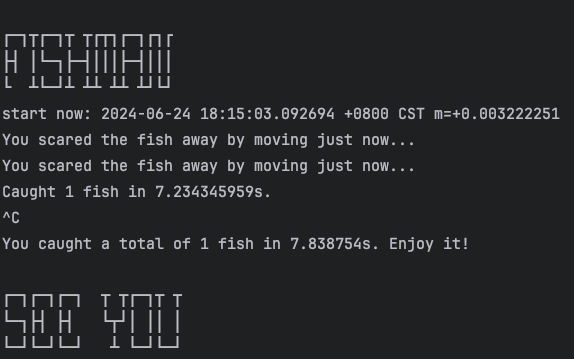

# Be a fishman
<textarea style="width: 100%;height: 100px;border: none;resize: none">
┌─┐┬┌─┐┬ ┬┌┬┐┌─┐┌┐┌
├┤ │└─┐├─┤│││├─┤│││
└  ┴└─┘┴ ┴┴ ┴┴ ┴┘└┘
</textarea>

Move your mouse to make the software think you are in front of the computer all the time.

After start the fishman  does not affect your mouse operation after startup.

* `go.mod`
```go
require (
	github.com/go-vgo/robotgo v0.110.0
	github.com/robotn/gohook v0.41.0
)
```

* `run`
```shell
go run main.go
```

* build
```shell
go build -o fishman main.go
```

* cross platform build need CGO
```shell
# windows
CGO_ENABLED=1 GOOS=windows GOARCH=amd64 CC="x86_64-w64-mingw32-gcc" go build -o fishman.exe main.go
```

